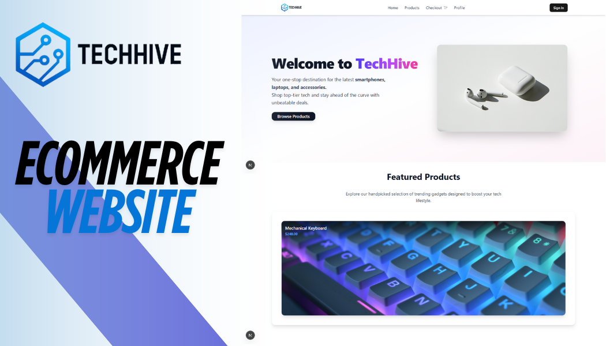

Project Demo: [Watch the Demo Video]([https://drive.google.com/file/d/YOUR_FILE_ID/view?usp=sharing](https://drive.google.com/file/d/1A7BO5w7OsahNwxu1cKB5SnsyGJ3ZaHjy/view?usp=drive_link))
TechHive – E-commerce with Admin Dashboard

TechHive is a modern e-commerce platform that includes an admin dashboard for a specific user. Built with Next.js and TypeScript, it provides a complete product management system, integrates Stripe for secure payments, uses Clerk for authentication, Supabase for image storage, and leverages Zustand, TailwindCSS, and shadcn/ui for state management and a clean, responsive UI.

This project is perfect for developers looking to build a fully functional e-commerce solution with a scalable tech stack.

🚀 Features
Admin Dashboard: Create, update, and delete products

Product Management: Upload images, set prices, and manage product details

Stripe Integration: Secure payment processing

Authentication: Protected admin routes with Clerk

Image Storage: Supabase storage for product images

State Management: Simplified state handling using Zustand

UI Components: Beautiful and accessible UI built with shadcn/ui

TailwindCSS: Utility-first CSS for responsive and fast styling

🔑 Admin User Configuration
You can define which user is allowed to access the admin dashboard by adding their Clerk User ID to your .env.local file:

bash
Copy
Edit
NEXT_PUBLIC_ADMIN_USER_ID=your_clerk_user_id_here
Only the user with this NEXT_PUBLIC_ADMIN_USER_ID will have access to the admin dashboard at /admin.

🛠️ Getting Started
Prerequisites
Stripe Account: Set up a Stripe account and get your API keys

Clerk Account: Set up Clerk for authentication

Supabase Account: Set up Supabase for image storage

Environment Variables
Create a .env.local file in the root directory and configure the following:

bash
Copy
Edit
# Clerk Authentication
NEXT_PUBLIC_CLERK_PUBLISHABLE_KEY=your_clerk_publishable_key_here
CLERK_SECRET_KEY=your_clerk_secret_key_here

# Admin User Configuration
NEXT_PUBLIC_ADMIN_USER_ID=your_clerk_user_id_here

# Stripe Configuration
STRIPE_SECRET_KEY=your_stripe_secret_key_here
NEXT_PUBLIC_STRIPE_PUBLISHABLE_KEY=your_stripe_publishable_key_here

# Supabase Configuration
NEXT_PUBLIC_SUPABASE_URL=your_supabase_url_here
NEXT_PUBLIC_SUPABASE_ANON_KEY=your_supabase_anon_key_here
SUPABASE_SERVICE_ROLE_KEY=your_supabase_service_role_key_here
Supabase Setup
Create a new Supabase project

Create a storage bucket named products for image uploads

Set the bucket to public for image access

Configure CORS policies if needed

Installation
bash
Copy
Edit
npm install
# or
yarn install
# or
pnpm install
Development
Run the development server:

bash
Copy
Edit
npm run dev
# or
yarn dev
# or
pnpm dev
Open http://localhost:3000 with your browser to view the app.

🛒 Admin Features
Create Products: Add new products with name, description, price, and image

Update Products: Edit existing product details, including price updates

Delete Products: Remove products from your store

Image Upload: Upload product images to Supabase storage

Real-time Updates: See changes instantly after operations

📚 Learn More
To learn more about the technologies used:

Next.js Documentation – Learn about Next.js features and API

Stripe Documentation – Integrate secure payments

Clerk Documentation – Manage authentication and users

Supabase Documentation – Store and retrieve images

Zustand – State management

shadcn/ui – Beautiful and reusable UI components

TailwindCSS – Utility-first CSS framework

🚀 Deployment
The easiest way to deploy your Next.js app is to use Vercel.

Check out the Next.js deployment documentation for more details.
